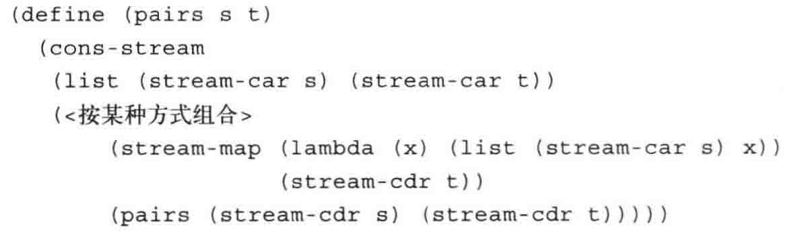

# what is computer science
与计算相关的研究

* 什么问题可以通过计算解决？可计算性
* 怎样解决这些问题
* 效率问题

# SICP

* 管理复杂性
    * 掌握抽象
* combining multiple ideas in large projects
* 计算机怎样解释程序语言

# python 基础
```python
    from math import pi
    radius = 10
    area, circ = pi * radius * radius, 2 * pi * radius
    from operator import, add, mul
```

## 函数定义
```python
    radius = 10
    def square(x):
        return mul(x, x)
    def sum_squares(x, y):
        return square(x) + square(y)
    # 可以直接捕获外部
    def area():
        retrun pi * radius * radius
```

## 表达式类型
* 简单表达式：Number or Numeral, name, string
* call expressions: Operator ans Operand

## 环境 Environment Diagrams
memory: 记录名字和变量函数的关系。sequence of frames

现在当前环境进行查找，找不到再向上一级进行查找，进入square后square优先代表一个变量。
```python
from operator import mul
def square(square):
    return mul(square, square)
square(-2)
```

## python: nonlocal
将外部函数变量捕获，以便在函数内使用。此时并没有新的变量产生，子函数对变量的修改会反应到外部函数。

**python的函数具有状态，类似于functor**
```python
def make_test_dice(*outcomes):
    """Return a die that cycles deterministically through OUTCOMES.
    >>> dice = make_test_dice(1, 2, 3)

    This function uses Python syntax/techniques not yet covered in this course.
    The best way to understand it is by reading the documentation and examples.
    """
    assert len(outcomes) > 0, 'You must supply outcomes to make_test_dice'
    for o in outcomes:
        assert type(o) == int and o >= 1, 'Outcome is not a positive integer'
    index = len(outcomes) - 1

    def dice():
        nonlocal index
        index = (index + 1) % len(outcomes)
        return outcomes[index]
    return dice
```

## 设计函数
文档字符串, help(func)显示文档字符串。
```python
def func():
    """ ........
    ......
    ......
    """
    return 0
```

## 测试与debug
```python
>>> assert fib(8) == 13, 'The 8th Fibonacci number should be 13'
>>> def fib_test():
        assert fib(2) == 1, 'The 2nd Fibonacci number should be 1'
        assert fib(3) == 1, 'The 3rd Fibonacci number should be 1'
        assert fib(50) == 7778742049, 'Error at the 50th Fibonacci number'
```

```python
>>> def sum_naturals(n):
        """Return the sum of the first n natural numbers.

        >>> sum_naturals(10)
        55
        >>> sum_naturals(100)
        5050
        """
        total, k = 0, 1
        while k <= n:
            total, k = total + k, k + 1
        return total
```

```python
"""
This is the "example" module.

The example module supplies one function, factorial().  For example,

>>> factorial(5)
120
"""


def factorial(n):
    """Return the factorial of n, an exact integer >= 0.

    >>> [factorial(n) for n in range(6)]
    [1, 1, 2, 6, 24, 120]
    >>> factorial(30)
    265252859812191058636308480000000
    >>> factorial(-1)
    Traceback (most recent call last):
        ...
    ValueError: n must be >= 0

    Factorials of floats are OK, but the float must be an exact integer:
    >>> factorial(30.1)
    Traceback (most recent call last):
        ...
    ValueError: n must be exact integer
    >>> factorial(30.0)
    265252859812191058636308480000000

    It must also not be ridiculously large:
    >>> factorial(1e100)
    Traceback (most recent call last):
        ...
    OverflowError: n too large
    """

    import math
    if not n >= 0:
        raise ValueError("n must be >= 0")
    if math.floor(n) != n:
        raise ValueError("n must be exact integer")
    if n+1 == n:  # catch a value like 1e300
        raise OverflowError("n too large")
    result = 1
    factor = 2
    while factor <= n:
        result *= factor
        factor += 1
    return result


if __name__ == "__main__":
    import doctest
    doctest.testmod()

```

```python
python3 -m doctest file.py [-v]
```

### Error Types
* SyntaxError
* IndentationError: 缩进错误
* TypeError
* NameError: 变量名未定义等
* IndexError: out of range

# Side effects and Pure Functions
A side effect is when something happens as a result of calling a function besides just returning a value.

* pure function: just return values
* Non-pure function: have side effects

# Multiple Enviroments
函数调用->new environment

# Higher-Order Function

## Generalizing Patterns with Arguments

* Functions are first-class: Functions can be manipulated as values in our language.

* Higher-order function: A function that takes a function as an argument value or returns a function as a return value

```python
def both(f, g):
    """Return a commentary function that says what f says, then what g says.

    >>> h0 = both(say_scores, announce_lead_changes())
    >>> h1 = h0(10, 0)
    Player 0 now has 10 and Player 1 now has 0
    Player 0 takes the lead by 10
    >>> h2 = h1(10, 8)
    Player 0 now has 10 and Player 1 now has 8
    >>> h3 = h2(10, 17)
    Player 0 now has 10 and Player 1 now has 17
    Player 1 takes the lead by 7
    """
    def say(score0, score1):
        return both(f(score0, score1), g(score0, score1))
    return say
```

# Lambda Expressions
Lambda Expressions are expressions that evaluate to functions.
```python
square = lambda x: x * x
square(4)
(lambda x: x * x)(3)
```

## python: Conditional Expressions(三目运算符？)
```
    <consequent> if <predicate> else <alternative>
```

```python
    # Relu
    lambda x: x if x > 0 else 0
```

# 应用序与正则序
* 先求值：应用序
* 先展开：正则序


# 递归与树形递归

## GCD（最大公约数）

求a，b的GCD，$r = a \% b$。

$GCD(a,b) = GCD(b,r)$

    Lame定理：如果欧几里得算法需要k步计算出一对整数的GCD，那么这对数中较小的数必然大于等于第k个斐波那契数

**证明**
$a = kb + r$，
假设$d$是$a,b$的一个公约数，
$r \div d = a \div d - kb \div d = 0$
所以$d$是$b, r$的一个公约数；

假设$d$是$b, r$的一个公约数，
$r\% d = (a - kd)\% d = a\% d - kb \%d = 0$，则$a \% d$为整数，
所以$d$是$a,b$的一个公约数。

```python
    from ucb import trace

    @trace
    def fib(n):
        if n == 0:
            return 0
        elif n == 1:
            return 1
        else:
            return fib(n - 2) + fib(n - 1)
```

# Y组合子，匿名递归函数
$\lambda f. (\lambda x. f (x x))(\lambda x. f (x x))$
对于任意$\lambda f.$，$(\lambda x. f (x x))(\lambda x. f (x x))$，是$f$的不动点
$$
\begin{align*}
    &X = (\lambda x. f (x x))(\lambda x. f (x x))\\
    &X = f (x x)[x := \lambda x. f (x x)] \quad \beta-reduction\\
    &X = f((\lambda x. f (x x))(\lambda x. f (x x)))\\
    &X = f(X)
\end{align*}
$$
匿名递归阶乘
```python
    (lambda f: lambda k: f(f, k))(lambda f, k: k if k == 1 else mul(k, f(f, k - 1)))
```

# 构造数据抽象

数据抽象的过程性（可以用过程构造数据）->消息传递
```python
    def cons(x, y):
        def dispatch(m):
            if m == 0:
                return x
            else:
                return y
        return dispatch


    def car(z):
        return z(0)
    def cdr(z):
        return z(1)
```

## 层次性数据和闭包性质
In general, an operation for combining data objects satisfies the closure property if the results of combining things with that operation can themselves be combined using the same operation.

### 序对表示序列
```
cons(1, cons(2，cons(3, cons(4, nil))))
```
### python sequence processing

#### List Comprehensions 
[\<map expression> for \<name> in \<sequence expression> if \<filter expression>]

```python
odds = [1, 3, 5, 7, 9]
[x + 1 for x in odds]

>>> [x for x in odds if 25 % x == 0]
[1, 5]
```

#### Aggregation
序列聚合成一个值
```python
>>> def divisors(n):
        return [1] + [x for x in range(2, n) if n % x == 0]
>>> divisors(4)
[1, 2]
>>> divisors(12)
[1, 2, 3, 4, 6]

>>> [n for n in range(1, 1000) if sum(divisors(n)) == n]
[6, 28, 496]
```

#### 序列操作的高阶函数形式
``` python
# List Comprehensions
>>> def apply_to_all(map_fn, s):
        return [map_fn(x) for x in s]
# List filter
>>> def keep_if(filter_fn, s):
        return [x for x in s if filter_fn(x)]
# aggregation
>>> def reduce(reduce_fn, s, initial):
        reduced = initial
        for x in s:
            reduced = reduce_fn(reduced, x)
        return reduced
```

apply_to_all -> map
keep_if -> filter
```python
>>> apply_to_all = lambda map_fn, s: list(map(map_fn, s))
>>> keep_if = lambda filter_fn, s: list(filter(filter_fn, s))

>>> from functools import reduce
>>> from operator import mul
>>> def product(s):
        return reduce(mul, s)
>>> product([1, 2, 3, 4, 5])
120
```

#### Membership 与 Slicing
```python
# membership
>>> digits
[1, 8, 2, 8]
>>> 2 in digits
True
>>> 1828 not in digits
True

# slicing
# [Initial : End : IndexJump]
>>> digits[0:2]
[1, 8]
>>> digits[1:]
[8, 2, 8]
# reverse 
digits[::-1]
```

### Python Trees
```python
>>> def tree(root_label, branches=[]):
        for branch in branches:
            assert is_tree(branch), 'branches must be trees'
        return [root_label] + list(branches)
>>> def label(tree):
        return tree[0]
>>> def branches(tree):
        return tree[1:]

>>> def is_tree(tree):
        if type(tree) != list or len(tree) < 1:
            return False
        for branch in branches(tree):
            if not is_tree(branch):
                return False
        return True
>>> def is_leaf(tree):
        return not branches(tree)

```

### Python Dictionary
```python
words = {
    "más": "more",
    "otro": "other",
    "agua": "water"
}

insects = {"spiders": 8, "centipedes": 100, "bees": 6}
for name in insects:
    print(insects[name])
```

#### Dictionary comprehensions
```python
{<key exp>: <value exp> for <name> in <iter exp> if <filter exp>}
```

```clojure
(define (deep_reverse tree)
    (define (deep_reverse_it tree re)
        (cond ((null? tree)
                re)
              (else 
                (deep_reverse_it (cdr tree)
                    (cons (if (pair? (car tree))
                              (deep_reverse (car tree))
                              (car tree))
                          re)))))
    (deep_reverse_it tree '()))
```

#### C++的map和filter
```C++
int main()
{
    auto const ints = {0,1,2,3,4,5};
    auto even = [](int i) { return 0 == i % 2; };
    auto square = [](int i) { return i * i; };
 
    // "pipe" syntax of composing the views:
    for (int i : ints | std::views::filter(even) | std::views::transform(square)) {
        std::cout << i << ' ';
    }
 
    std::cout << '\n';
 
    // a traditional "functional" composing syntax:
    for (int i : std::views::transform(std::views::filter(ints, even), square)) {
        std::cout << i << ' ';
    }
    std::cout << std::endl;
    return 0;
}
```

### 序列操作

#### filter
```clojure
(define (filter predicate sequence)
    (cond ((null? sequence) nil)
          ((predicate (car sequence))
           (cons (car sequence)
                 (filter predicate (cdr sequence))))
          (else (filter predicate (cdr sequence)))))
```

#### fold_left and fold_right
```clojure
(define (reverse sequence)
    (fold_right (lambda (x y)
                    (cons y x))
                '()
                sequence))

(define (reverser sequence)
    (fold_right (lambda (x y) 
                    (append y (list x)))
                '()
                sequence))
```

## 可加性
基于类型的分派不具有可加性

数据导向or消息传递

### 数据导向
将\<op>和\<type>建表，通过
```clojure
(put <op> <type> <item>)
(get <op> <type>)
```
实现分发

## 不同类型数据的组合

强制->类型转换

层次->类型塔（继承）


# 模块化、对象和状态

## python tuple
不可变
```python 
code = ("up", "up", "down", "down") + ("left", "right") * 2
```

tuple中有list，可以改变list内的值。

dictionary 的键值需要immutable。

## 引入non-local assignment的好处
每个functor可以维持自己的状态

## 引入non-local assignment的代价
identity or equal?


what it means for two values to be the same?

### Implementing Lists and Dictionaries

## Implicit Sequences
惰性求值：program that delays the computation of a value until that value is needed.

### 惰性求值的函数
map, zip and reversed是惰性求值

### generator
A generator is an iterator returned by a special class of function called a generator function.

区分生成函数：yield

generator.\_\_next\_\_()->调用生成函数

yield->resume

### Iterable interface
如果一个对象在调用其 \_\_iter\_\_ 方法时返回一个迭代器，则它是可迭代的。可迭代值表示数据集合，它们提供了一种固定的表示形式，可以产生多个迭代器。

注意区分迭代器（iterator）和可迭代对象（Iterable）

可以用iter()获取一个Iterable的iterator

yield 可以使\_\_iter\_\_ 每次调用返回全新instance->得到与next类似的功能

```python
class LettersWithYield:
        def __init__(self, start='a', end='e'):
            self.start = start
            self.end = end
        def __iter__(self):
            next_letter = self.start
            while next_letter < self.end:
                yield next_letter
                next_letter = chr(ord(next_letter)+1)
```

直接使用next，此时为iterator：
```python
class LetterIter:
        """An iterator over letters of the alphabet in ASCII order."""
        def __init__(self, start='a', end='e'):
            self.next_letter = start
            self.end = end
        def __next__(self):
            if self.next_letter == self.end:
                raise StopIteration
            letter = self.next_letter
            self.next_letter = chr(ord(letter)+1)
            return letter
```

iterator是mutable，iterator是lazy的

## python class

getattr(instance, 'attribute')

hasattr(instance, 'attribute')

```python
>>> type(Account.deposit)
<class 'function'>
>>> type(spock_account.deposit)
<class 'method'>
```

A central concept in object abstraction is a _generic function_, 接受多种类型的值
* shared interfaces
* type dispatching
* type coercion

Python 规定所有对象都应该产生两种不同的字符串表示形式：一种是人类可解释的文本，一种是 Python 可解释的表达式。

```python
repr(object) -> string

str(object)

def repr(x):
    return type(x).__repr__(x)
```

Return the canonical string representation of the object. For most object types, eval(repr(object)) == object.

repr应该是一个polymorphic function，one that can be applied to many (_poly_) different forms (_morph_) of data.

调用instance的\_\_str\_\_().

str()调用**类**的\_\_str\_\_()而非**instance**的\_\_str\_\_()
```python
class Bear:
    def __init__(self):
        self.__repr__ = lambda: 'oski'
        self.__str__ = lambda: 'this bear'
    
    def __repr__(self):
        return 'Bear()'

    def __str__(self):
        return 'a bear'

oski = Bear()
print(oski)                 # a bear
print(str(oski))            # a bear
print(repr(oski))           # Bear()
print(oski.__str__())       # this bear
print(oski.__repr__())      # oski
```

### Special Methods
* \_\_bool\_\_
* \_\_len\_\_
* \_\_getitem\_\_
* \_\_call\_\_

```python
class Adder(object):
    def __init__(self, n):
        self.n = n
    def __call__(self, k):
        return self.n + k

>>> add_three_obj = Adder(3)
>>> add_three_obj(4)
7
```
### shared interface
见./code/extensible_data_abstraction/complex.py

### type dispatching
见./code/extensible_data_abstraction/rational.py


This dictionary-based approach to type dispatching is extensible. New subclasses of Number could install themselves into the system by declaring a type tag and adding cross-type operations to Number.adders and Number.multipliers. They could also define their own adders and multipliers in a subclass.
### type coercion
rational -> complex


注意强制类型转换中的信息消失（精度损失等）

### Set
* set.union(set)
* set.intersection(set)
* set.add()
* set.remove()
* set.discard()

### F-string (String Interpolation)
```python
f'pi starts with {pi}...'
```

## 赋值和局部状态
```clojure
(define new-withdraw
    (let ((balance 100))
        (lambda (amount)
            (if (>= balance amount)
                (begin (set! balance (- balance amount))
                        balance)
                "Insufficient funds"))))
```

### 引进赋值带来的利益
模拟局部状态随时间变化的对象

### 引进赋值的代价
不用任何赋值的程序设计->函数式程序设计

代换模型不再适用，对于无赋值过程：
```clojure
(define (make-decrementer balance)
    (lambda (amount)
        (- balance amount)))
```
可以利用代换模型：
```clojure
((make-decrementer 25) 20)

((lambda (amount) (- 25 amount)) 20)

(- 25 20)
```

对于有赋值过程：
```clojure
(define (make-simplified-withdraw balance)
    (lambda (amount)
        (set! balance (- balance amount))
        balance))
```
如果进行代换分析：
```clojure
((make-simplified-withdraw 25) 20)

((lambda (amount) (set! balance (- 25 amount)) 25) 20)
;;  对于 (set! balance (- 25 amount)) 25，先将balance设置为5，然后返回25
;;
```
代换模型无法区分变量变动前后的值。现在的变量（a variable can no longer be simply a name）。
Now a variable somehow refers to a place where a value can be stored，and the value stored at this place can change.

A language that supports the concept that ``equals can be substituted for equals'' in an expresssion without
changing the value of the expression is said to be referentially transparent. Equals可一相互替换，则语言具有**引用透明性**。引入赋值打破引用透明性。side effect对别名（alias）的影响。

* 同一性
* 命令式语言的缺陷：表达式的求值顺序

## 求值的环境模型
变量具有“位置”。these places will be maintained in structures called **environments**. An environment is a sequence of **frames**. Each frame is a table (possibly empty) of **bindings**。bindings 将一些name关联于对应的值，一个frame内，任何变量只能对应一个binding，一个frame还包含pointer指向外部环境（enclosing environment）。如果没有外围环境，那讨论的frame就是全局的。**The value of a variable** with respect to an environment is the value given by the binding of the variable in the first frame in the environment that contains a binding for that variable.
If no frame in the sequence specifies a binding for the variable, then the variable is said to be unbound in the environment.


3个frame，A、B、C、D是环境指针。

### 求值规则
1. 求值各个子表达式（程序不应该依赖子表达式的顺序）
2. 将运算符子表达式的值应用于运算对象子表达式的值


* constructing a frame -> binding the formal parameters to the argument -> evaluating the procedure in the new environment constructed (新frame的enclosing environment 是创建该过程的environment).

对于赋值来说：lookup binding -> 修改binding以表示新值

### Frames as the Repository of Local State


应用对象时，
```clojure
(define W1 (make-withdraw 100))

(W1 50)
```
关键在于创建W1时新创建了一个environment，对应的frame中binding balance到100。

### 环境模型中的内部定义
* 局部过程中的name不会与过程外的name相互干扰，因为这些局部过程名在该过程运行时创建的frame里进行binding

## 变动数据的建模

### 变动的表结构
* set-car!
* set-cdr!

#### 共享和相等

### 队列的表示
只能从一端插入另一端删除

* make-queue
* empty-queue?
* front-queue (不修改队列)
* insert-queue! <queue><item>
* delete-queue! <queue>

### 表格的表示

### 数字电路模拟器

## 并发：时间是一个本质问题

锁的实现：检查和设置之间禁止时间分片

其他方式：内存屏障

延展->分布式系统中的并发

## Stream
流：lazy的表

* delay \<exp\> -> 延时对象
* force 延时对象

```clojure
(cons-stream <a> <b>)
;; 等价于
(cons <a> (delay <b>))

(define (stream-car stream) (car stream))
(define (stream-cdr stream) (force (cdr stream)))
```


流处理的每个阶段都仅仅活动到满足下一个阶段的程度，松弛了事件发生顺序和过程的表面结构的关系。

```clojure
(delay <exp>)
(lambda () <exp>)

;;
(define (force delayed-object)
    (delayed-object))

;;记忆性->多次force时不必多次计算
(define (memo-proc proc)
    (let ((already-run? false) (result false))
        (lambda ()
            (if (not already-run?)
                (begin (set! result (proc))
                       (set! already-run? true)
                       result)
                result))))
(delay <exp>);;等价于
(memo-proc (lambda () <exp>))
```

### 无穷流
```clojure
(define (intergers-starting-from n)
    (cons-stream n (intergers-starting-from (+ n 1))))
(define integers (integers-starting-from 1))
```

厄拉多塞筛法：构造素数流
```clojure
(define (sieve stream)
    (cons-stream
        (stream-car stream)
        (sieve (stream-filter
                (lambda (x)
                    (not (divisible? x (stream-car stream))))
                (stream-cdr stream)))))

(define primes (sieve (integers-starting-from 2)))
```


#### 可以用流A定义流A


#### 流实现分数除法
3.58


### 流计算模式的使用
提供局部状态和赋值的许多效益，避免引入赋值的理论困难。

#### 序对的无穷流
用流S和流T生成(pairs S T):



### 流和延时求值
delay至关重要！

变动性和和延时求值在程序设计语言里结合的不好。（ex-3.51, ex-3.52）

### Python Streams

Like an Link, the rest of a Stream is itself a Stream. Unlike an Link, the rest of a stream is only computed when it is looked up, rather than being stored in advance. 

rest 部分惰性求值